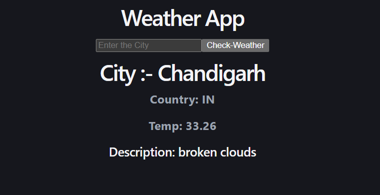

# Simple Weather App

A simple weather app built using React and Axios.

## Features
- Search weather by city name
- Shows city and country
- Displays temperature
- Displays weather description

## Tech Stack
- React
- Vite
- Axios
- OpenWeather API

## API Setup

Create a `.env` file in the root folder and add:

```env
VITE_API_KEY=your_api_key_here
```

## Preview


## Author
Vishal_Vee